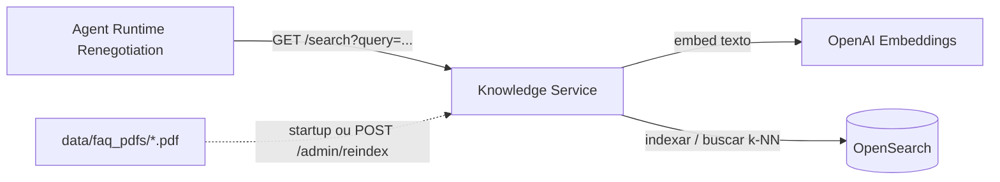

# Knowledge Service

Serviço de busca de conhecimento (RAG) da plataforma de IA conversacional: ingere PDFs de FAQ de renegociação de dívida e expõe busca semântica (vetorial, k-NN) sobre esse conteúdo.

Este serviço implementa o contrato que `agent-runtime-renegotiation` **já chama de verdade** (`app/tools/knowledge.py`, `GET /search`) — antes deste serviço existir, toda busca de FAQ falhava fechado com uma mensagem de indisponibilidade.

## Visão geral



## Stack

- Python 3.12
- FastAPI
- Uvicorn
- opensearch-py (async)
- OpenAI (embeddings)
- pypdf
- OpenTelemetry
- Pytest

## Responsabilidades

- Extrair texto de PDFs de FAQ colocados em `data/faq_pdfs/`, dividir em chunks e gerar embeddings via OpenAI.
- Indexar os chunks no OpenSearch (`faq_chunks`, campo `knn_vector`) para busca semântica.
- Reingerir de forma idempotente — por hash de conteúdo do arquivo — no startup e sob demanda (`POST /admin/reindex`), sem precisar reiniciar o container.
- Expor `GET /search?query=...` respondendo com os trechos de FAQ mais relevantes acima de um score mínimo de relevância.
- Responder `503` (nunca travar) quando OpenSearch ou a API de embeddings da OpenAI estiverem indisponíveis.

## Endpoints

Todos exigem `Authorization: Bearer <jwt-interno>` e `X-Tenant-Id: <tenant>` (validado contra a claim assinada), exceto `/health/live`, `/health/ready`, `/metrics` e `/docs`.

| Método | Rota | Descrição |
|---|---|---|
| `GET` | `/search?query=...` | Retorna `{"results": [{"title", "content", "score"}]}` — contrato já consumido por `agent-runtime-renegotiation`. Lista vazia quando nada supera o score mínimo (inclusive índice vazio). Busca no índice do tenant autenticado. |
| `POST` | `/admin/reindex` | Reescaneia o diretório de FAQ do tenant autenticado, ingerindo o que for novo ou tiver mudado. Retorna um resumo (`files_indexed`, `files_skipped`, `files_failed`, `chunks_written`). |
| `GET` | `/health/live`, `/health/ready` | Liveness/readiness; `/health/ready` verifica a chave de assinatura JWT, `OPENAI_API_KEY` e conectividade com OpenSearch. |

## Isolamento por tenant

Cada tenant tem seu próprio índice OpenSearch (`{OPENSEARCH_INDEX_PREFIX}-{tenant_id}`) e, por convenção, seu próprio subdiretório de PDFs em `FAQ_PDF_DIR/{tenant_id}/` — exceto o tenant configurado em `DEFAULT_TENANT_ID`, que usa a raiz de `FAQ_PDF_DIR` diretamente (caminho de migração/compatibilidade, para não exigir mover os PDFs existentes para uma subpasta).

## Configuração

O serviço usa `pydantic-settings`, com suporte a variáveis de ambiente.

| Variável | Default | Descrição |
|---|---:|---|
| `OPENAI_API_KEY` | (vazio) | Chave de API da OpenAI, usada para embeddings. Sem ela, a ingestão no startup é pulada (log de aviso) e `GET /search` responde `503`. |
| `EMBEDDING_MODEL` | `text-embedding-3-small` | Modelo de embeddings da OpenAI. |
| `OPENSEARCH_URL` | `http://localhost:9200` | URL do OpenSearch. |
| `OPENSEARCH_INDEX_PREFIX` | `faq_chunks` | Prefixo do nome do índice; o índice real é `{prefix}-{tenant_id}`. |
| `FAQ_PDF_DIR` | `data/faq_pdfs` | Diretório raiz com os PDFs de FAQ (subdividido por tenant — ver acima). |
| `DEFAULT_TENANT_ID` | `00000000-0000-0000-0000-000000000001` | Tenant que usa `FAQ_PDF_DIR` diretamente, sem subpasta. |
| `CHUNK_SIZE` / `CHUNK_OVERLAP` | `1000` / `150` | Tamanho e sobreposição dos chunks de texto (caracteres). |
| `SEARCH_TOP_K` | `3` | Quantidade de resultados buscados por consulta. |
| `MIN_RELEVANCE_SCORE` | `0.70` | Score mínimo (similaridade de cosseno normalizada) para um resultado ser retornado. |
| `OTEL_OTLP_ENDPOINT` | `http://localhost:4317` | Endpoint OTLP para tracing (Jaeger). |
| `INTERNAL_AUTH_ENABLED` | `true` | Se `false`, os endpoints não exigem JWT (uso local/teste); `X-Tenant-Id` continua obrigatório. |
| `INTERNAL_AUTH_SIGNING_KEY` | (vazio) | Chave HS256 usada para validar o JWT recebido. Obrigatória com auth habilitada. |

## Como executar localmente

### Pré-requisitos

- Python 3.12
- OpenSearch acessível (localmente ou via `docker compose up opensearch` no `conversational-ai-demo-arch`)
- Uma `OPENAI_API_KEY` real (sem ela, o serviço sobe normalmente mas não ingere nem busca nada)
- `INTERNAL_AUTH_SIGNING_KEY` com pelo menos 32 bytes, igual ao configurado no `agent-runtime-renegotiation` (chamador de `/search`)

### Criar ambiente virtual

```bash
python -m venv .venv
```

Ativar no Windows: `.venv\Scripts\activate` — Linux/macOS: `source .venv/bin/activate`.

### Instalar dependências

```bash
pip install -r requirements.txt
pip install -r requirements-dev.txt   # para desenvolvimento e testes
```

### Adicionar FAQs

Coloque arquivos `.pdf` (com texto real, não escaneado) em `data/faq_pdfs/` — ver `data/faq_pdfs/README.md`.

### Subir a API

```bash
uvicorn app.main:app --host 0.0.0.0 --port 8500 --reload
```

Swagger: `http://localhost:8500/docs`

## Testes

```bash
python -m pytest
```

> Use `python -m pytest`, não o script `pytest` isolado — sem o `python -m`, o diretório do projeto não entra no `sys.path` e a suíte inteira falha com `ModuleNotFoundError: No module named 'app'` (é exatamente por isso que o workflow de CI usa `python -m pytest`).

Os testes mockam o client da OpenAI (`respx`) e o client do OpenSearch (`unittest.mock`), e geram PDFs de fixture em tempo de execução com `reportlab` — não dependem de infraestrutura real nem de PDFs reais de FAQ. `PlatformMiddleware` é contornado nos testes de endpoint mutando o singleton `app.main.settings` (`internal_auth_enabled=False`) em vez de assinar um JWT de verdade, já que a instância é fixada na app na inicialização e não é resolvida via `Depends` a cada request.

## CI

`.github/workflows/ci.yml` roda `pip install`/`python -m pytest` a cada push/PR para `master`.

## Estrutura

```text
.
├── app
│   ├── api
│   │   ├── search.py
│   │   └── admin.py
│   ├── config.py
│   ├── dependencies.py
│   ├── embeddings.py
│   ├── errors.py
│   ├── ingestion.py
│   ├── logging_setup.py
│   ├── main.py
│   ├── models.py
│   ├── opensearch_client.py
│   ├── pdf_extraction.py
│   └── chunking.py
├── data
│   └── faq_pdfs/
├── tests
├── requirements.txt
├── requirements-dev.txt
├── pyproject.toml
└── knowledge-service.pyproj
```

## Integrações

### Agent Runtime Renegotiation

Já chama `GET /search` de verdade (`app/tools/knowledge.py`) — nenhuma mudança de código foi necessária nele; o `KNOWLEDGE_SERVICE_BASE_URL` já apontava para este serviço por padrão. Validado ponta a ponta: uma pergunta sobre documentos necessários dispara a tool `search_knowledge_base`, que chama este serviço e recebe conteúdo real de FAQ, usado pelo agente para fundamentar a resposta.

### OpenSearch / OpenAI

Primeiro (e único) consumidor do OpenSearch neste workspace. Usa a API de embeddings da OpenAI — mesma `OPENAI_API_KEY` já usada por `agent-runtime-renegotiation`, sem credencial nova.

## Observações técnicas

- O engine de k-NN usado é `lucene` (não `nmslib`, descontinuado para criação de índice a partir do OpenSearch 3.0).
- O client do OpenSearch usa `timeout=3`/`max_retries=0`: sem isso, uma falha de conexão demoraria ~9s (3 tentativas) em vez de ~3s antes de responder `503`.
- `data/faq_pdfs/` é montado como bind mount no `docker-compose.yml` (não só copiado na build da imagem) — um PDF adicionado ali fica visível para `POST /admin/reindex` sem precisar reconstruir a imagem.
- Ingestão é idempotente por hash de conteúdo do arquivo inteiro (não por chunk): mudar um único parágrafo de um PDF reembeda o arquivo inteiro.

## Próximos passos sugeridos

- Remover chunks órfãos no OpenSearch quando um PDF é removido de `data/faq_pdfs/` (hoje a ingestão não detecta remoções, só arquivos novos/alterados).
- Busca híbrida (BM25 + k-NN) em vez de apenas vetorial.
- Persistir logs de ingestão/recuperação em `conversation-memory-service` (`document_chunks`/`rag_retrievals`, já provisionados no MongoDB) para auditoria.
